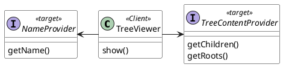
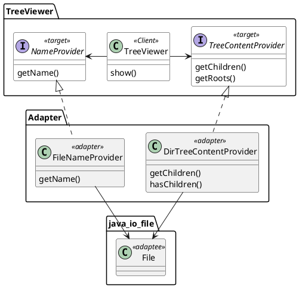

# Adapter

## 模式结构



## 问题（TreeViewer）

有很多的数据都可以树的方式可视化的显示。如何设计和分配职责使得不同结构的树的显示能够尽可能避免重复的代码。


## 示例1：简单树形结构（SimpleTree.java)

将一个复杂的数据以树的方式呈现，这是UI中的一个常见的需求。

比如，下图是一个简单的属性结构的呈现：

```
    ├── 1
    ├── 2
    │   ├── 4
    │   ├── 5
    │   │   └── 7
    │   └── 6
    └── 3 
```

从组织机构，到文件夹的内容，背后都有一个树形结构的数据，都可以使用树形来表现。如何能够方便地将这样的一个数据结构呈现出来。


## 示例2：文件目录(FolderTree)

```

├── visitor
│   ├── visitor.worksheet.sc
│   ├── visitor.scala
│   ├── README.md
│   ├── diagram.md
│   └── livedemo
│       ├── visitor.scala
│       └── livedemo.worksheet.sc
└── strategy
    ├── README.md
    ├── livedemo
    │   ├── strategy.scala
    │   └── strategy.worksheet.sc
    ├── strategy.scala
    └── strategy.worksheet.sc
```



## 示例3：上下级关系(OrgTree.java)

```
List<Employee> employees = Arrays.asList(
        new Employee("John", null),
        new Employee("Mary", "John"),
        new Employee("Jim", "John"),
        new Employee("Joe", "Mary"),
        new Employee("Jane", "Mary"));

└── John
    ├── Mary
    │   ├── Joe
    │   └── Jane
    └── Jim
```

## vscode中写一个tree的plugin
https://code.visualstudio.com/api/extension-guides/tree-view

## 思考

如何测试TreeView.show和showTreeWithLines的正确性？