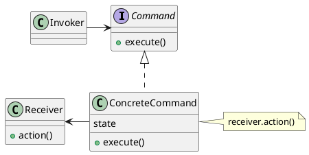
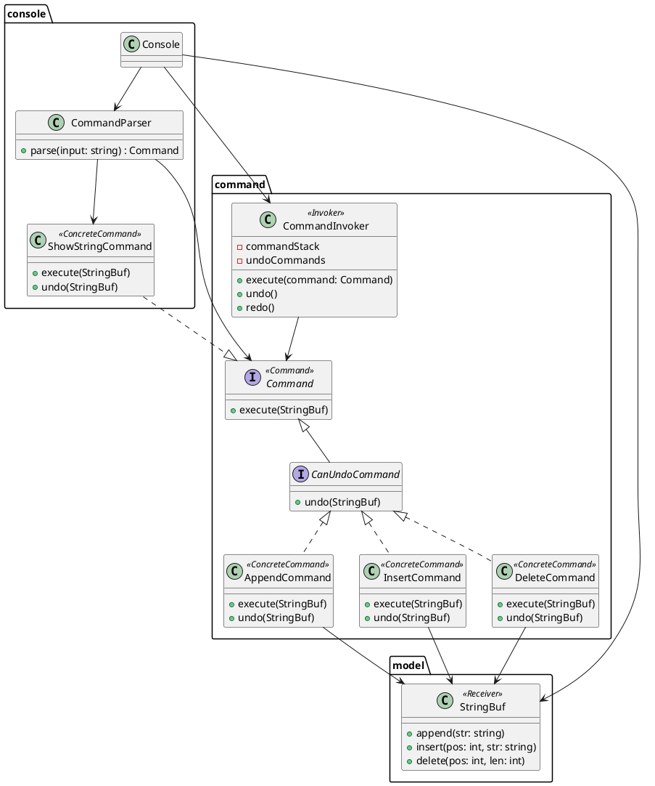
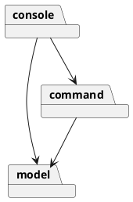

# 命令模式

## 模式结构

```plantuml
@startuml
interface Command{
    +execute()
}

class ConcreteCommand implements Command{
    +execute()
    state
}
class Receiver{
    +action()
}
class Invoker{
}
Receiver <- ConcreteCommand
Invoker -> Command

note right of ConcreteCommand: receiver.action()

@enduml
```

## 示例

编写一个基于命令行的字符串编辑器，支持字符串的追加、插入、删除等操作。编辑操作需要支持undo和redo。
命令如下：
* 追加： a 'string'
* 插入： i pos 'string'
* 删除： d pos len
* 显示当前编辑缓存的内容: l

## 主要类及其关系如下：

```plantuml
@startuml


package model{
    class StringBuf <<Receiver>> {
        +append(str: string)
        +insert(pos: int, str: string)
        +delete(pos: int, len: int)
    }
}
package command{

    interface Command <<Command>> {
        +execute(StringBuf)
    }

    interface CanUndoCommand extends Command{
        +undo(StringBuf)
    }

    class AppendCommand<<ConcreteCommand>> implements CanUndoCommand {
        +execute(StringBuf)
        +undo(StringBuf)
    }
    class InsertCommand<<ConcreteCommand>> implements CanUndoCommand {
        +execute(StringBuf)
        +undo(StringBuf)
    }
    class DeleteCommand<<ConcreteCommand>> implements CanUndoCommand {
        +execute(StringBuf)
        +undo(StringBuf)
    }

    class CommandInvoker<<Invoker>> {
        -commandStack
        -undoCommands

        +execute(command: Command)
        +undo()
        +redo()
    }
    CommandInvoker --> Command

}

package console{
    class CommandParser{
        +parse(input: string) : Command
    }

    class ShowStringCommand<<ConcreteCommand>> {
        +execute(StringBuf)
        +undo(StringBuf)
    }

    class Console

    Console --> CommandParser
    CommandParser --> ShowStringCommand

    
}

AppendCommand --> StringBuf
InsertCommand --> StringBuf
DeleteCommand --> StringBuf
Console -> StringBuf
CommandParser --> Command
ShowStringCommand ..|> Command 
Console -> CommandInvoker

@enduml
```

## Package之间的关系如下：

```plantuml
@startuml

package model
package command
package console

console --> command
console --> model
command --> model
```