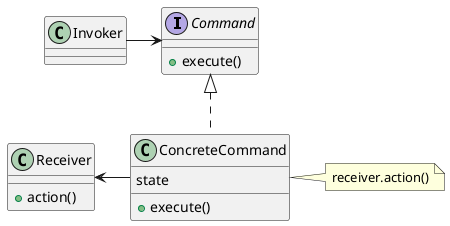
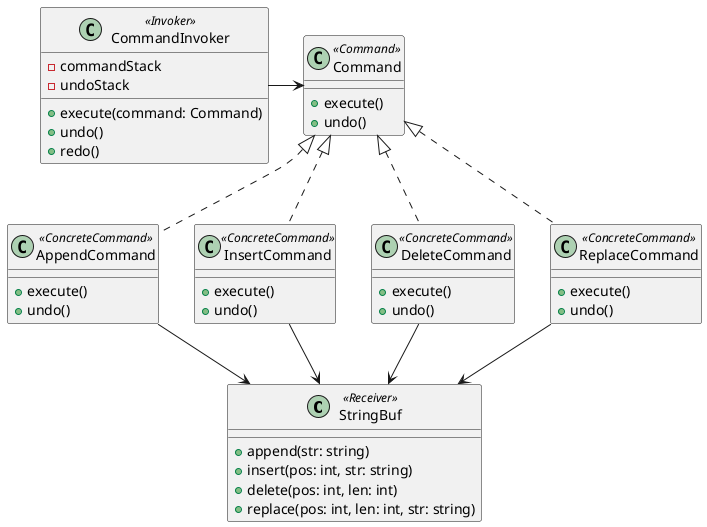

# 命令模式

## 模式结构

```plantuml
@startuml
interface Command{
    +execute()
}

class ConcreteCommand implements Command{
    +execute()
    state
}
class Receiver{
    +action()
}
class Invoker{
}
Receiver <- ConcreteCommand
Invoker -> Command

note right of ConcreteCommand: receiver.action()

@enduml
```

## 示例

编写一个基于命令行的字符串编辑器，支持字符串的追加、插入、删除等操作。编辑操作需要支持undo和redo。
命令如下：
追加： a value
插入： i pos value
删除： d pos len

```plantuml
@startuml
class StringBuf <<Receiver>> {
    +append(str: string)
    +insert(pos: int, str: string)
    +delete(pos: int, len: int)
    +replace(pos: int, len: int, str: string)
}

class Command <<Command>> {
    +execute()
    +undo()
}
class AppendCommand<<ConcreteCommand>> implements Command {
    +execute()
    +undo()
}
class InsertCommand<<ConcreteCommand>> implements Command {
    +execute()
    +undo()
}
class DeleteCommand<<ConcreteCommand>> implements Command {
    +execute()
    +undo()
}
class ReplaceCommand<<ConcreteCommand>> implements Command {
    +execute()
    +undo()
}

class CommandInvoker<<Invoker>> {
    -commandStack
    -undoStack

    +execute(command: Command)
    +undo()
    +redo()
}

AppendCommand --> StringBuf
InsertCommand --> StringBuf
DeleteCommand --> StringBuf
ReplaceCommand --> StringBuf

CommandInvoker -> Command
@enduml
```