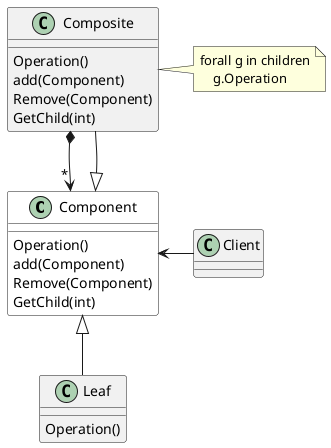
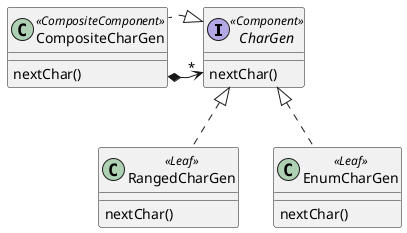

# Composite 模式

## Composite模式结构


## Demo需求：


写一组API，能够产生满足指定规则的随机字符，比如：
1. 产生一个大写字符
2. 产生一个小写字符
3. 产生一个数值字符

## phase1 过程式(scala)

```scala
    def getRandomCharacter(ch1: Char , ch2:Char ) : Char = {
        return (ch1 + Random.nextInt(ch2 - ch1 + 1)).toChar;
    }
    
    def getRandomLowerCaseLetter = getRandomCharacter('a','z')
    def getRandomUpperCaseLetter = getRandomCharacter('A', 'Z')
    def getRandomDigitCharacter = getRandomCharacter('0', '9')
    def getRandomUnicodeCharacter = getRandomCharacter('\u0000', '\uFFFF')

    def getRandomRangesCharacter(ranges: List[(Char, Char)]) =
        val selectedIndex = Random.nextInt(ranges.length)
        getRandomCharacter(ranges(selectedIndex)._1, ranges(selectedIndex)._2)

```
问题：

1. 如何生成从指定的一组字符中随机选取的字符?
```scala
getEnumCharacter('$','_')
```


2. 如何产生一个随机的大写字母**或**数字？

```scala
getRandomRangesCharacter(
    List(('A','Z'),('0','9'))
)
```

3. 如何生成某个语言的合法的标识符首字符，比如：^[a-zA-Z_$]

    如何传递 getEnumCharacter ?

4. 如何通过上面的函数生成一个指定长度的String?


## phase2 使用接口进行抽象

## Phase2 Composite Pattern



## phase3 函数式(Scala)

```scala
  type CharGen = () => Char

  val lowecaserGen: CharGen = () => phase1.getRandomLowerCaseLetter
  val uppercaseGen: CharGen = () => phase1.getRandomUpperCaseLetter
  val unicodeGen: CharGen = () => phase1.getRandomUnicodeCharacter
  val digitGen: CharGen = () => phase1.getRandomUnicodeCharacter
  def enumGen(s: Char*) = () => s(Random.nextInt(s.length))
  def compositeGen(gens: CharGen*): CharGen = () =>
    gens(Random.nextInt(gens.length))()
  def string(gen: CharGen, len: Int) = List.fill(len)(gen()).mkString
  
```