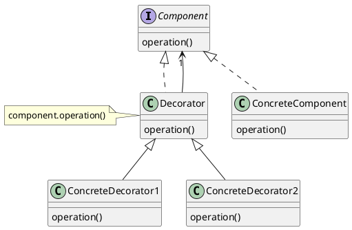
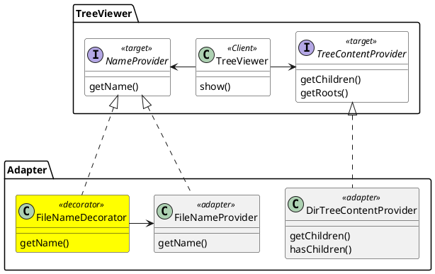

# Decorator Pattern

## 模式结构

```plantuml
@startuml
interface Component{
    operation()
}

class ConcreteComponent implements Component{
    operation()
}

class Decorator implements Component{
    operation()
}

class ConcreteDecorator1 extends Decorator{
    operation()
}

class ConcreteDecorator2 extends Decorator{
    operation()
}

Component "1" <-- Decorator

note left of Decorator: component.operation()

@enduml
```

## 案例

给文件树的名字加后缀，目录的结尾加上'/',文件的结尾加上时间戳。

```plantuml
@startuml

package TreeViewer{
class TreeViewer <<Client>> #white{
    show()
}
interface TreeContentProvider <<target>> #white{
    getChildren()
    getRoots()
}
interface NameProvider<<target>> #white{
    getName()
}
TreeViewer -> TreeContentProvider
NameProvider <- TreeViewer
}
package Adapter{
    class DirTreeContentProvider<<adapter>>{
        getChildren()
        hasChildren()
    }
    class FileNameProvider<<adapter>>{
        getName()
    }
    TreeContentProvider <|.. DirTreeContentProvider
    NameProvider <|.. FileNameProvider

    class FileNameDecorator<<decorator>> #yellow{
        getName()
    }
    NameProvider <|..- FileNameDecorator    
    FileNameDecorator -> FileNameProvider
}
@enduml
```