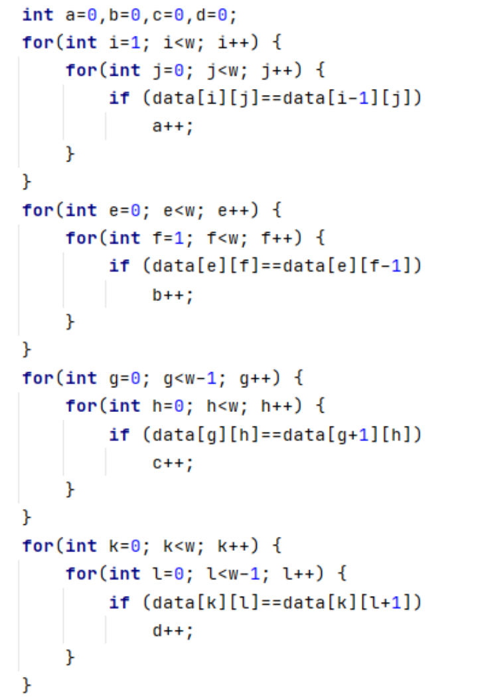
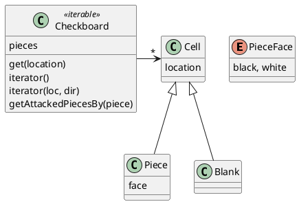

# Iterator 模式

## Iterator 模式结构

提供一种方法顺序访问一个聚合对象中各个元素，而又不暴露该对象的内部表示。


```plantuml
interface Iterable{
    iterator()
}

interface Iterator{
    hasNext()
    next()
}

Iterable -> Iterator

class ConcreteIterable <<Iterable>> implements Iterable{
    iterator()
}

class ConcrtetIterator <<Iterator>> implements Iterator{
    hasNext()
    next()

}

ConcreteIterable -> ConcrtetIterator

```

## 场景 1： 棋盘的遍历

CheckerBoard.java

## 场景 2： 循环遍历

Rotated.java


## 场景 3： 斐波那级数(scala)

fab.scala

## 问题 ： 基于二维棋盘的游戏

注意：由于采用了函数式的功能，本例完整示例代码为scala。


有很多游戏是基于二维棋盘的，比如围棋，象棋，国际黑白棋，五子棋等。考虑两种游戏：

1. 黑白棋
2. 2048

这些游戏需要对棋盘上棋子按照某些规则进行查找，如果不进行恰当的抽象，代码很容易写成下面的样子：

代码片段1：



如果进行抽象，尽可能减少这类代码。

下面考虑两个案例。

## 1. 黑白棋
对于黑白棋游戏，即在一个二维的棋盘上放置黑白棋子的游戏。

1. 如何获取已经落下的所有棋子
2. 如果一颗棋子落下后，它能够在八个方向上攻击其他颜色的棋子，如果获取它可以攻击到的所有棋子。


## 方案



getAttackedPiecesBy 是用于获取一个落子(piece)能够在八个方向上攻击到哪些对方的棋子。

使用迭代器模式，计算的框架如下：

* 构造包含从落子位置开始的所有8个方向的集合
* 对每个方向
    * 获取每个方向开始的迭代器
    * 获取沿该方向的第一个棋子
    * 只留下对手棋子


## 代码(scala)

```scala
// 所有方向
Direction.values.toList
.map(dir =>
    //从落子开始的每个方向的迭代器
    iterator(piece.location, dir)
    //第一个非空白的棋子
    .collectFirst { 
        case p @ Piece(location, face) => p
    }
)
//有些方向没有棋子，需要过滤掉
.collect { case Some(value) =>
    value
}
//只选取对手棋子
.filter(_.face.isOpposite(piece.face))
```

## 2. 2048

2048是大家熟悉的游戏，游戏操作很简单，就是在一个2048*2048的棋盘上，每个格子上放置一个数字，数字的大小是2的n次方，每次操作选择一个方向，游戏按照特定的规则对该方向所有列进行一个变换。

请大家自行考虑如何使用迭代器模式来帮助实现2048游戏。