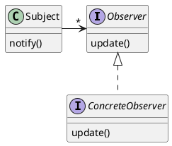
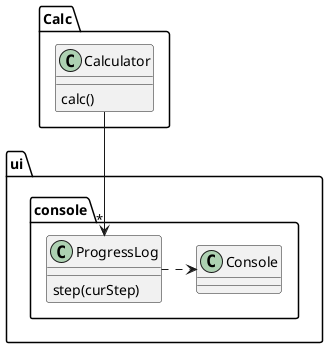
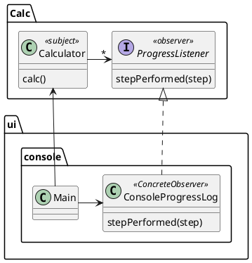

# Observer模式



# 场景 1 : 复杂计算
Calculation.calc中有比较复杂的计算，可以分解为n步，每次执行一步需要更新进度条。

## phase1

未采用设计模式，直接耦合




## phase2

采用观察者模式



# 场景2：Observer模式与Reactive Programming（拓展学习）

Reactive Programming 是一种编程范式，它把数据流作为数据源，把函数作为转换函数，把数据流作为数据结果。

Reactive Programming可以看做是Observer模式和函数式编程的结合。


---


# 场景2：Demo

```java
// Observable, 能够输出(emit)字符串流
Observable<String> observable = Observable.just(
        "Hello",
        "World");
observable
        .subscribe(System.out::println);

```

# 场景2：Demo

```java
// Observable, 能够输出(emit)字符串流，输出前变为大写
Observable<String> observable = Observable.just(
        "Hello",
        "World");
observable
        .map(a -> a.toUpperCase())
        .subscribe(System.out::println);

```