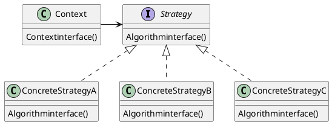
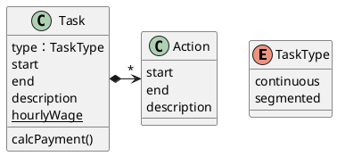
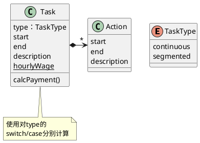
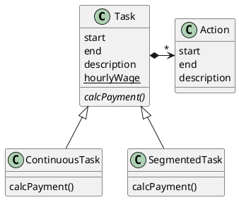
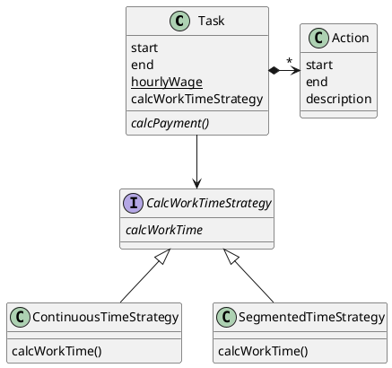
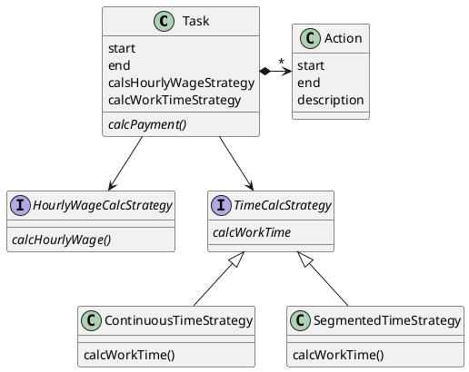

# 策略模式

# Strategy模式结构

## 需求：

Task记录了任务的执行时用掉的时间。Task会一次或多次执行，每次执行都被记录在Action中。

Task这个类的最主要的接口是计算工时费(calcPayment)。

在计算Task的工时费时，有两种计算方法：
1. 按Task的开始和结束时间来计算
2. 按Task中Action的开始和结束时间的和来计算
   
## Phase1

---
## Phase2 使用继承

---

## Phase3 使用策略模式

# 思考 

## 问题1：

增加一种分类方式：时薪的计算

## 问题2：

如果确定一个任务究竟是segmented还是continuous取决于更大的上下文，比如组织机构的性质，或者是一个可配置的系统的参数，而不是在构造任务的时候能够方便地确定的，应该如何设计？

