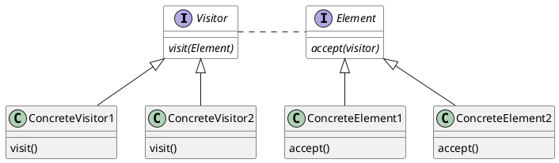
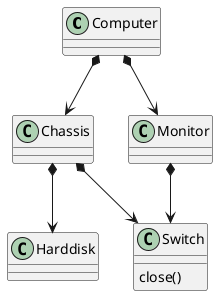
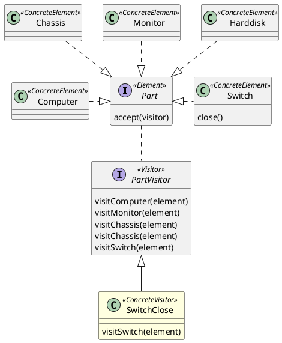

# Visitor 模式

## Visitor 模式结构




## 问题 
假设电脑（Computer）有包括主机箱（Chassis）和显示器（Monitor），主机箱和显示器上都有开关（Switch），主机箱中有硬盘（Harddisk）。这个设备结构可以用如下的类图表示：




需要写一段代码关闭指定电脑`computer`设备上的所有开关。


## Phase1: 不使用设计模式模式

```typescript
computer.monitor.switch.close()
computer.chassis.switch.close()
```

这种情况下，如果设备结构变得复杂，设备上有多个开关的情况下，很容易漏掉开关。


## Phase2：在这个结构上应用visitor模式
在应用了visitor模式后，关闭整个设备的代码如下：

```scala
  computer.accept(new PartVisitor() {
    override def visit(part: Switch) = 
        part.close()
  })
```
在这种情况下，设备上无论在什么地方增加了开关，这段代码都会正确地完成关闭动作。

应用visitor模式后，类结构如下：


## Phase3：在HardDisk上增加Switch

实现代码参考p3, 用于关闭开关的visitor无需修改

