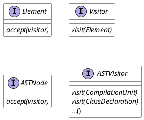
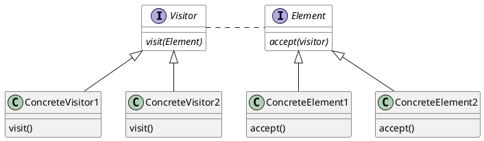
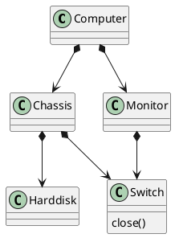
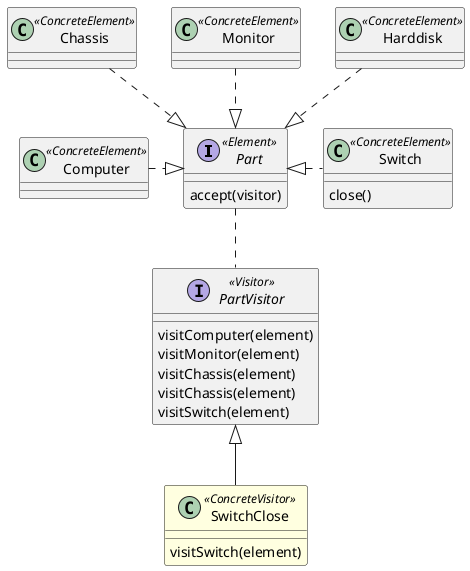

---



```typescript
//未使用
computer.monitor.switch.close()
computer.chassis.switch.close()

class SwitchClose extend PartVisitorImpl{
    visit(sw : Switch){
        sw.close()
    }
}
computer.accept(new SwitchClose());
```


