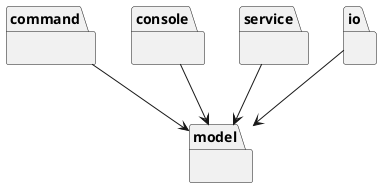
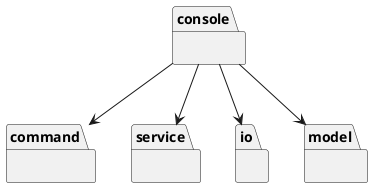
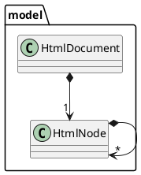
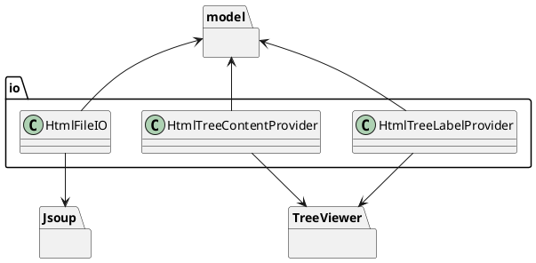
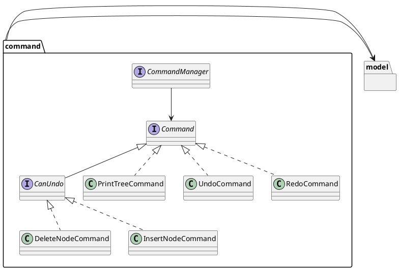
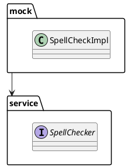
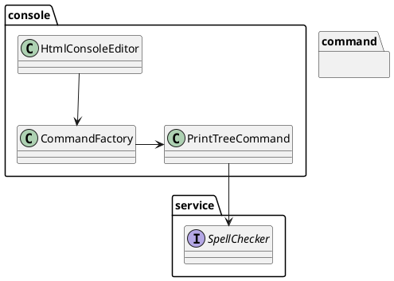

```plantuml
@startuml
package model{}
package command{}
package console{}
package service{}
package io{}

command --> model
console --> model
service --> model
io --> model
@enduml
```

```plantuml
@startuml
package command{}
package console{}
package service{}
package io{}
package model{}

console --> command
console --> service
console --> io
console --> model
@enduml
```

---

## model

```plantuml
@startuml
package model{
    class HtmlNode
    class HtmlDocument

    HtmlDocument *--> "1" HtmlNode
    HtmlNode *--> "*" HtmlNode
}
@enduml
```

---

## io

```plantuml
@startuml


package Jsoup{}
package io{
    class HtmlFileIO
    class HtmlTreeContentProvider
    class HtmlTreeLabelProvider
}

package TreeViewer{
}
package model{}
model <-- HtmlFileIO
model <-- HtmlTreeContentProvider
model <-- HtmlTreeLabelProvider

HtmlTreeContentProvider --> TreeViewer
HtmlTreeLabelProvider --> TreeViewer

HtmlFileIO --> Jsoup
@enduml
```

## command

```plantuml
@startuml
package command{
    interface Command{}
    interface CommandManager{}
    interface CanUndo extends Command{}
    class PrintTreeCommand implements Command{}
    class DeleteNodeCommand implements CanUndo{}
    class InsertNodeCommand implements CanUndo{}
    class UndoCommand implements Command{}
    class RedoCommand implements Command{}
    CommandManager --> Command
}
command -> model
package model{}


command --> model
@enduml
```

## service

```plantuml
@startuml
package service{
    interface SpellChecker{}
}

package mock{
    class SpellCheckImpl
}
mock --> service
@enduml
``` 

## console

```plantuml
@startuml
package service{
    interface SpellChecker{}
}
package command{
}
package console{
    class CommandFactory
    class HtmlConsoleEditor
    class PrintTreeCommand

    HtmlConsoleEditor --> CommandFactory
    CommandFactory -> PrintTreeCommand
    PrintTreeCommand --> SpellChecker
}
@enduml
``` 

## 注意
1. 关于迭代器
2. 关于适配器模式
3. 关于装饰器
4. 关于依赖注入
5. 关于单元测试