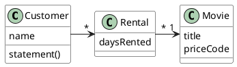
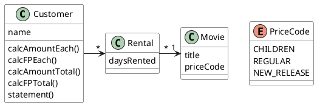
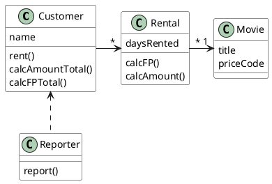
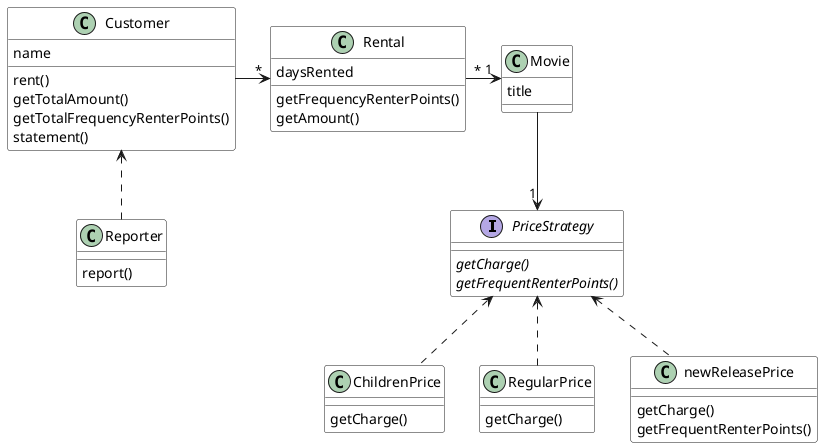

## Before refactor

```plantuml
@startuml
class Customer #white{
    name
    statement()
}
class Rental #white{
    daysRented
}
class Movie #white{
    title
    priceCode
}
Customer -> "*" Rental
Rental "*" -> "1" Movie
@enduml
```

-----
## Refactor phase 1

```plantuml
@startuml
class Customer #white{
    name
    calcAmountEach()
    calcFPEach()
    calcAmountTotal()
    calcFPTotal()
    statement()
}
class Rental #white{
    daysRented
}
class Movie #white{
    title
    priceCode
}
enum PriceCode #white{
    CHILDREN
    REGULAR
    NEW_RELEASE
}
Customer -> "*" Rental
Rental "*" -> "1" Movie
@enduml
```

----

## Refactor phase 2

```plantuml
@startuml
class Customer #white{
    name
    rent()
    calcAmountTotal()
    calcFPTotal()
}
class Rental #white{
    daysRented
    calcFP()
    calcAmount()
}
class Movie #white{
    title
    priceCode
}
class Reporter #white{
    report()
}
Customer <.. Reporter
Customer -> "*" Rental
Rental "*" -> "1" Movie
@enduml
```

---
## Refactor phase 3

## Apply Strategy Pattern

```plantuml
@startuml
interface PriceStrategy #white{
    {abstract} getCharge()
    {abstract} getFrequentRenterPoints()
}

class ChildrenPrice #white{
    getCharge()
}
class RegularPrice #white{
    getCharge()
}
class newReleasePrice #white{
    getCharge()
    getFrequentRenterPoints()
}
PriceStrategy <.. ChildrenPrice
PriceStrategy <.. RegularPrice
PriceStrategy <.. newReleasePrice

class Customer #white{
    name
    rent()
    getTotalAmount()
    getTotalFrequencyRenterPoints()
    statement()
}
class Rental #white{
    daysRented
    getFrequencyRenterPoints()
    getAmount()
}
class Movie #white{
    title
}
class Reporter #white{
    report()
}
Customer <.. Reporter
Movie --> "1" PriceStrategy
Customer -> "*" Rental
Rental "*" -> "1" Movie

@enduml
```