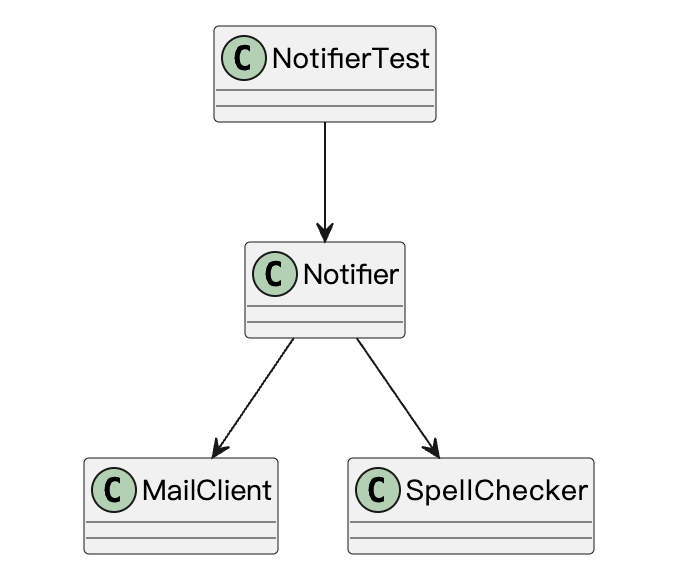
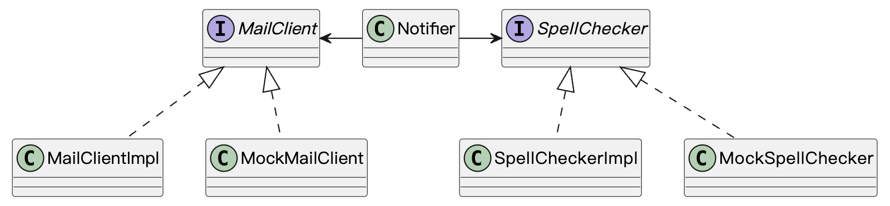
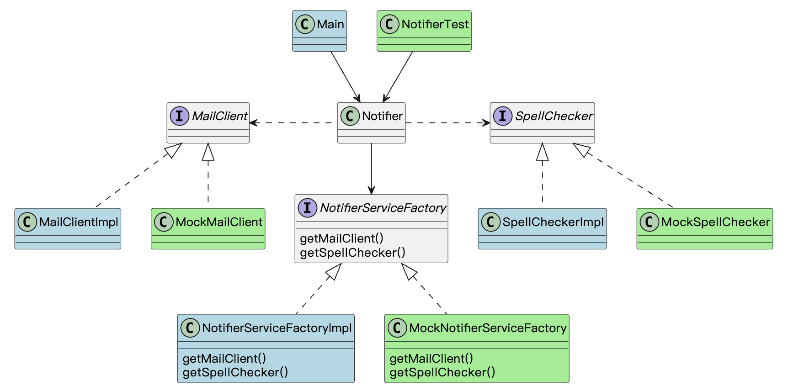
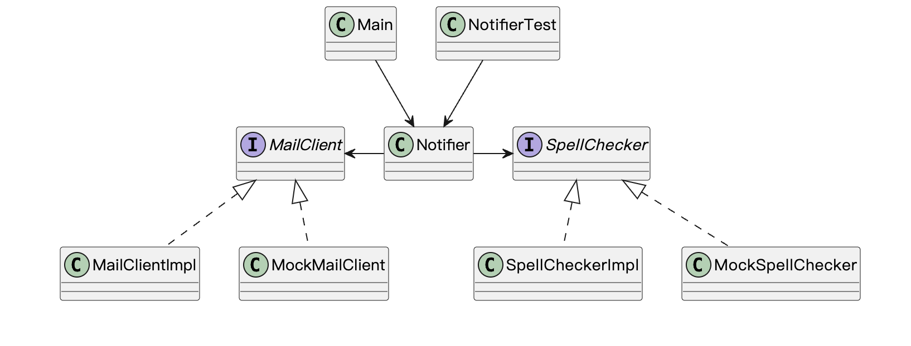

# Spring-framework and DI

Spring Framework is an open-source Java framework that is used to develop enterprise applications. It provides a range of features such as Dependency Injection (DI), Inversion of Control (IoC), and Aspect-Oriented Programming (AOP) to simplify the development of enterprise applications.

---


# Spring-framework

Spring was initially started as an alternative to more heavy approaches
to enterprise applications such as the J2EE standard. 

It made it possible to cleanly separate the framework from the code by allowing the configuration of POJOs (Plain Old Java Objects) rather than forcing classes to extend a certain class or implement an interface.

---

# Spring Modules
* Core – Inversion of Control container(IoC Container), configuration of application components, and life-cycle management of Beans.

* Spring MVC (Model-View-Controller) – An HTTP and servlet-based framework providing hooks for extension and customization for web applications and RESTful (Representational State Transfer) web services.

---

# Spring Modules

* Testing – Supports classes for writing both unit and integration tests such as Spring MVC Test which supports testing the controllers of Spring MVC applications.

* Spring Boot – Convention over configuration framework for simplifying application development. It includes auto-configuration and has “starter” dependencies
that include many open source dependencies and the compatible versions of each dependency.

---

# Spring Modules
* Spring Data 
* Spring Security
* Aspect-oriented programming (AOP)
* Messaging
* Transaction management
* ......
  
---

# 

# Core Spring
Core Spring includes Spring’s Dependency Injection (DI) framework and configuration.

The DI framework allows for the creation of objects and their dependencies in a controlled and organized manner. It provides a way to decouple the code that uses the objects from the code that creates and configures them.

---

# Dependency injection with Spring

Dependency injection (DI) is a specialized form of IoC, whereby objects define their dependencies (that is, the other objects they work with) only through 

* constructor arguments
* arguments to a factory method
* properties that are set on the object instance after it is constructed or returned from a factory method. 

The IoC container then injects those dependencies when it creates the bean. 

---

# Dependency injection with Spring Sample

Required component: PaymentProcessor

Component: define a injectable interface PaymentProcessor

```java
public interface PaymentProcessor {
    void processPayment(double amount);
}

@Component
public class PayPalProcessor implements PaymentProcessor {
    @Override
    public void processPayment(double amount) {
        // Logic to process payment using PayPal
    }
}

```

---

# Dependency injection with Spring Sample

Autowired: Declare the dependency to Required component

```java
@Service
public class PaymentService {
    @Autowired
    private PaymentProcessor paymentProcessor;

    public void processPayment(double amount) {
        paymentProcessor.processPayment(amount);
    }
}

```

---

# Dependency injection with Spring Sample

Dependency injection:

```java
public static void main(String[] args) {
    ApplicationContext ctx = new AnnotationConfigApplicationContext(AppConfig.class);
    PaymentService paymentService = ctx.getBean(PaymentService.class);
    paymentService.processPayment(1000.0);
}
```
---


# 案例
假设需要开发一个通知模块，需要生成一段文本，并进行拼写检查，成功后通过邮件客户端发送消息。

---

# 未使用接口(naive)



---

# 未使用接口(naive)

oop.demo.naive.Notifier.java

### 问题:
1. 如果checkSpell, mailClient涉及到付费服务，如何测试？
2. 如何切换到其他的的服务供应商？
3. 如何通过自动化测试判定mailClient发出的内容是正确的？、

--- 


# 引入接口
上述问题的根源是依赖的不合理，可以通过引入接口来实现。


问题：如何获取接口的实例？

---


# 抽象工厂




---

# 抽象工厂

抽象工厂的问题：过于复杂，过多与工厂相关的代码

---

# 依赖翻转(Dependency inversion)

在面向对象设计中，依赖翻转原则是一种用于实现松耦合软件模块的具体方法。遵循该原则时，从低层次依赖模块高层次所建立的传统依赖关系被颠倒，从而使高层模块与低层模块的具体实现细节相互独立。

---


# Manual-DI solutions:手动注入




---

# Manual-DI solutions:手动注入

手动注入DI:
Demo: 
* oop.demo.manual_di.Notifier.java
* oop.demo.manual_di.NotifierTest.java

---

# Manual-DI solutions:手动注入
手工作坊式DI的问题

如果考虑到类之间的依赖关系

```java
class OrderService{
     EMailer emailer;
     public OrderService(EMailer emailer){
          this.emailer = emailer
     }
}
new OrderService(
     new EMailer(
          new MailClientImpl(), 
          new SpellCheckImpl()
     )
)
```

随着业务复杂度的增加，一个类构造的时候需要带越来越长的参数。

---

# Container-DI solutions

Demo:oop.demo.container_di.*


