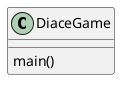
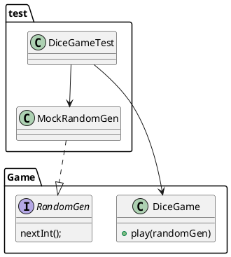
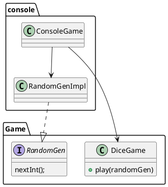

# TDD

# p1

```plantuml
@startuml
class DiaceGame{
    main()
}
@enduml
```

# p2

```plantuml
@startuml

package Game{
interface RandomGen{
    nextInt();
}
class DiceGame {
    +play(randomGen)
}
}


package test{
    class MockRandomGen
    class DiceGameTest
    MockRandomGen..|> RandomGen
}

DiceGameTest --> DiceGame
DiceGameTest --> MockRandomGen
```

# p3

```plantuml
@startuml

package Game{
interface RandomGen{
    nextInt();
}
class DiceGame {
    +play(randomGen)
}
}


package console{
    class RandomGenImpl
    class ConsoleGame
    RandomGenImpl..|> RandomGen
}

ConsoleGame --> DiceGame
ConsoleGame --> RandomGenImpl
```